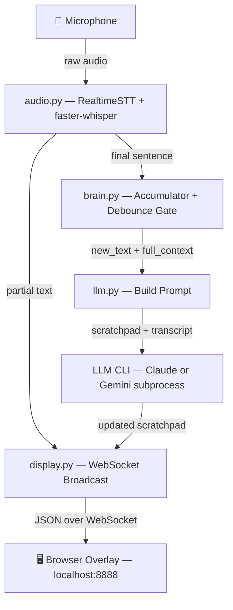

# Architecture — Interview Helper

Real-time AI interview assistant. Listens to your mic, transcribes speech, and
maintains a live **scratchpad** of concise answer hints on screen.

---

## File Tree

```
interview-helper-feature/
├── main.py                  # Orchestrator — wires all components
├── requirements.txt         # Python deps (RealtimeSTT, aiohttp, etc.)
├── src/
│   ├── audio.py             # Mic capture → transcript chunks
│   ├── brain.py             # Transcript accumulator + debounced LLM trigger
│   ├── llm.py               # LLM subprocess wrapper (Claude CLI + Gemini CLI)
│   └── display.py           # HTTP/WebSocket server + overlay HTML (KaTeX, controls)
├── wiki/                    # Pre-compiled knowledge base (unused, kept for reference)
│   ├── index.md
│   └── topics/
├── tests/
│   └── test_demo.py         # Demo tests with mocked LLM
├── google/                  # Study materials (read-only source)
├── AGENTS.md                # Agent instructions
└── CLAUDE.md -> AGENTS.md   # Symlink
```

---

## End-to-End Flow



---

## How It Works — Step by Step

### 1. Audio Capture (`audio.py`)
- **RealtimeSTT** opens the mic via PyAudio and runs **faster-whisper** locally.
- Two callback streams:
  - **Partial text** → sent straight to the browser as a live transcript ticker.
  - **Final chunk** → a complete sentence, forwarded to the Brain.

### 2. Transcript Accumulation (`brain.py`)
- Stores timestamped `TranscriptChunk` objects in a **90-second rolling window**.
- On each new final chunk, checks two gates:
  - ⏱ **Debounce**: at least 3 seconds since last trigger.
  - 🔒 **Busy lock**: skip if an LLM call is already in-flight.
- If both pass → fires `on_update(new_text, full_context)` to the orchestrator.

### 3. LLM Call (`llm.py`)
- Builds a structured prompt with XML-tagged sections:
  ```
  <current_scratchpad>...</current_scratchpad>
  <transcript>...</transcript>
  ```
- Supports two providers, selected at runtime via the UI dropdown:
  - **Claude**: `claude -p <prompt> --model <model> [--effort <level>]`
  - **Gemini**: `gemini -m <model>` with prompt via stdin
- 20s timeout. LLM returns only the updated scratchpad — no explanation, no headers.
- Formulas are requested in LaTeX (`$...$`) for KaTeX rendering in the browser.

### 4. Display (`display.py`)
- **aiohttp** serves the overlay HTML at `http://localhost:8888`.
- Browser connects via **WebSocket** (`ws://localhost:8888/ws`).
- Four message types pushed to clients:
  | Type         | Content                          |
  |--------------|----------------------------------|
  | `scratchpad` | Full updated pad (replaces DOM)  |
  | `updating`   | "Thinking..." indicator          |
  | `transcript` | Partial live transcript ticker   |
  | `error`      | Error message from LLM           |
- UI features: dark theme, flash animation on changed lines, bold rendering, **KaTeX** for LaTeX formulas.
- **Controls**: dropdowns for STT model, LLM model (Claude/Gemini), and effort level. Settings sent to server via WebSocket.

### 5. Orchestrator (`main.py`)
- Wires callbacks: audio → brain → LLM → display.
- Manages the global `_current_scratchpad` state.
- Runs the async event loop (`asyncio.run`).

---

## Scratchpad Rules

| Rule                | Detail                                      |
|---------------------|---------------------------------------------|
| Max bullets         | 8                                           |
| Bullet length       | ≤ 15 words, keyword-dense                   |
| Urgent marker       | ⚡ prefix on most critical point             |
| Formatting          | **Bold** key terms, numbers; LaTeX formulas (`$...$`) |
| Sub-points          | `→` with 2-space indent                     |
| Topic change        | Old bullets replaced automatically          |

---

## Threading Model

```
Main Thread (asyncio)
├── aiohttp server (display.py)
│   └── WebSocket handlers
│
├── Audio Thread (daemon)
│   └── RealtimeSTT blocking loop
│       ├── on_realtime_text → broadcast_threadsafe()
│       └── on_text → brain.add_text()
│           └── brain.on_update callback
│               └── LLM Thread (daemon)
│                   └── subprocess: claude -p ... | gemini -m ...
│                       └── on_result → broadcast_threadsafe()
```

`broadcast_threadsafe()` bridges worker threads to the asyncio loop using
`asyncio.run_coroutine_threadsafe()`.
